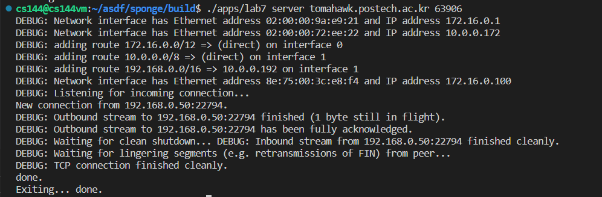

Assignment 7 Writeup
=============

My name: 송문경

My POVIS ID: moonsong98

My student ID (numeric): 20180423

My assignment partner's name: 곽찬영

My assignment partner's POVIS ID: gwakcy

My assignment partner's ID (numeric): 20190936

This assignment took me about [3] hours to do (including the time on studying, designing, and writing the code).

If you used any part of best-submission codes, specify all the best-submission numbers that you used (e.g., 1, 2): []

- **Caution**: If you have no idea about above best-submission item, please refer the Assignment PDF for detailed description.

Solo portion:

- Did your implementation successfully start and end a conversation with another copy of itself?
    Yes.
    
- Did it successfully transfer a one-megabyte file, with contents identical upon receipt?
    Yes.
    
- Please describe what code changes, if any, were necessary to pass these steps.
    Nope.

Group portion:
- What is your team’s name? Who is your partner (and what is their POVIS ID)?
    - Team Name: Andreessen
    - Partner: 곽찬영(gwakcy)
- Did your implementations successfully start and end a conversation with each other (with each implementation acting as “client” or as “server”)?
    - Yes
    - Server(문경), Client(찬영)
        |Server|Client|
        |:----:|:----:|
        |  |  |
    - Server(찬영), Client(문경)
        |Server|Client|
        |:----:|:----:|
        |  |  |
- Did you successfully transfer a one-megabyte file between your two implementations, with contents identical upon receipt?
    - Yes
    - Server(문경), Client(찬영)
        |Server|Client|
        |:----:|:----:|
        |  |  |
    - Server(찬영), Client(문경)
        |Server|Client|
        |:----:|:----:|
        |  |  |
- Please describe what code changes, if any, were necessary to pass these steps, either by you or your partner.
    Nope.

Creative portion (optional):
Nope.

Other remarks:
Nope.

- Optional: I had unexpected difficulty with: [describe]

- Optional: I think you could make this assignment better by: [describe]

- Optional: I was surprised by: [describe]

- Optional: I'm not sure about: [describe]
